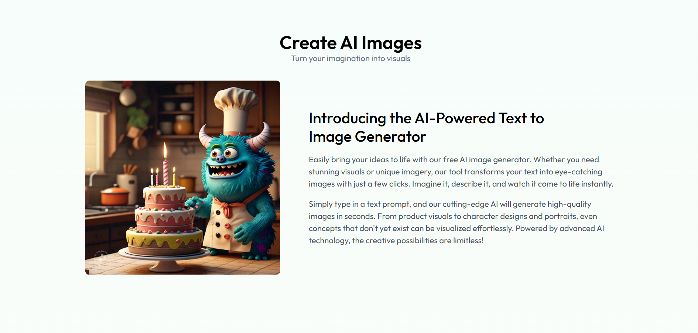

# Estico AI

Estico AI is an AI-powered image generation platform that converts text prompts into high-quality images. It provides an easy-to-use API for developers, artists, and creatives to explore AI-driven art and enhance their projects with unique visuals.

## Features

- Text-to-image generation with AI
- High-quality images in a variety of styles
- User credit balance management for generating images

## Installation

### Clone the repository

```bash
git clone https://github.com/your-username/Estico-AI.git
```

##Overview :




